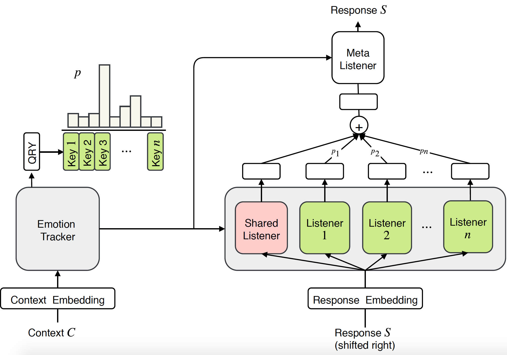
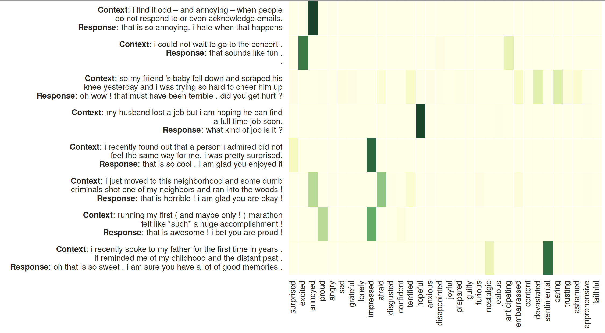

## MoEL: Mixture of Empathetic Listeners


This is the Tensorflow 2.4.0 implementation of the paper:

**MoEL: Mixture of Empathetic Listeners**. [**Zhaojiang Lin**](https://zlinao.github.io/), Andrea Madotto, Jamin Shin, Peng Xu, Pascale Fung  ***EMNLP 2019*** [[PDF]](https://arxiv.org/pdf/1908.07687.pdf)

This code has been written using Tensorflow 2.4.0. If you use any source codes or datasets included in this toolkit in your work, please cite the following paper. The bibtex is listed below:
<pre>
@article{lin2019moel,
  title={MoEL: Mixture of Empathetic Listeners},
  author={Lin, Zhaojiang and Madotto, Andrea and Shin, Jamin and Xu, Peng and Fung, Pascale},
  journal={arXiv preprint arXiv:1908.07687},
  year={2019}
}
</pre>

## MoEL Architecture:
<p align="center">

</p>
The proposed model Mixture of Empathetic Listeners, which has an emotion tracker, n empathetic listeners along with a shared listener, and a meta listener to fuse the information from listeners and produce the empathetic response.

## Attention on the Listeners

<p align="center">

</p>

The visualization of attention on the listeners: The left side is the context followed by the responses generated by MoEL. The heat map illustrate the attention weights on 32 listeners

## Data
Data is located in folder /vectors/empathetic-dialogue.

## Replication Authors
- Shaoyu Liu
- Shihang Wang
- Tianqing Zhou

## Organization of this directory
```bash
├── README.md
├── empathetic-dialogue
│   ├── sys_dialog_texts.dev.npy
│   ├── sys_dialog_texts.test.npy
│   ├── sys_dialog_texts.train.npy
│   ├── sys_emotion_texts.dev.npy
│   ├── sys_emotion_texts.test.npy
│   ├── sys_emotion_texts.train.npy
│   ├── sys_situation_texts.dev.npy
│   ├── sys_situation_texts.test.npy
│   ├── sys_situation_texts.train.npy
│   ├── sys_target_texts.dev.npy
│   ├── sys_target_texts.test.npy
│   └── sys_target_texts.train.npy
├── generation_result.txt
├── main.ipynb
├── model
│   ├── common_layer.py
│   ├── transformer.py
│   └── transformer_mulexpert.py
├── plot
│   ├── MoEL.png
│   ├── MoL.png
│   └── tf_logo_social.png
├── requirements.txt
└── utils
    ├── config.py
    ├── data_loader.py
    ├── data_reader.py
    ├── metric.py
    ├── multi-bleu.perl
    └── test.py
```
## Code Structure
| File      | Description                                                                   |
|-----------|-------------------------------------------------------------------------------|
|main.py      | model training and testing. 
|data_reader.py                   | read raw text files and convert to required format
|data_loader.py               | load and convert input data in tf Dataset
|config.py       | configurations and parameters
|metrics.py  | metrics for evaluation
|common_layer.py                  | utils and layer functions used to construct main models
|transformer.py                   | baseline transformer model
|transformer_mulexpert.py      |  multi-expert transformer model


- data_reader.py

| Class      | Description                                                                   |
|-----------|-------------------------------------------------------------------------------|
| Lang | Implements a method that facilitates easy conversion between words in text and index.
| clean | clean and tokenize words in input sentence
| read_langs | Read and preprocessing data and create data_train, data_dev, data_test and vocab files.
| load_dataset | Construct 3 dictionaries data_tra, data_val, data_tst and save them.

- data_loader.py

| Class      | Description                                                                   |
|-----------|-------------------------------------------------------------------------------|
| process_items | Calls preprocess functions to convert words and emotion strings to indices
| preprocess | Convert words to indices
| preprocess_emo | Preprocess emotions
| convert_to_dataset | Define a python generator of the input data and convert it to `tf.data.Dataset` ready for use in Tensorflow
| prepare_data_seq | A wrapper that calls load_dataset, process_item and convert_dataset to load, process and convert data into correct format.

- common_layer.py

| Class      | Description                                                                   |
|-----------|-------------------------------------------------------------------------------|
|EncoderLayer      | one encoder layer in vanilla Transformer
|DecoderLayer      | one decoder layer in vanilla Transformer
|MultiExpertMultiHeadAttention | the multi-head multi-expert (decoder) attention layer
|MultiHeadAttention | the standard multi-head attention layer
|PositionwiseFeedForward | the position-wise feed forward layer (Linear + RELU + Linear)
|Conv | Convenience class that does padding and convolution for inputs in the format \[batch_size, sequence length, hidden size\]
|_gen_bias_mask | Generates bias values (-Inf) to mask future timesteps during attention
|_gen_timing_signal | Compute timestep signal (positional encoding)
|_get_attn_subsequent_mask | Get an attention mask to avoid using the subsequent info, used in input embedding for decoder
| OutputLayer | Abstract base class for output layer. Handles projection to output labels
|SoftmaxOutputLayer | Implements a softmax based output layer
| position_encoding | Alternative way to compute positional encoding
| gen_embeddings | Generate initial random embedding matrix for input vocabularies.
| Embeddinglayer | Generate the embedding layer and scale it by square root of embedding dimension.
| get_input_from_batch | return Tensors enc_batch, enc_padding_mask, enc_lens, enc_batch_extend_vocab, extra_zeros, c_t_1, coverage from one input batch (a tuple of tensors) for encoder
| get_output_from_batch | return Tensors dec_batch, dec_padding_mask, max_dec_len, dec_lens_var, target_batch from one input batch (a tuple of tensors) for decoder.
|sequence_mask | Compute sequence of masks for positions that are padded.

- transformer.py

| Class      | Description                                                                   |
|-----------|-------------------------------------------------------------------------------|
|Encoder      | the encoder module in Transformer (a stack of encoder layers)
|Decoder      | the decoder module in Transformer (a stack of decoder layers)
|Generator      | the linear and softmax transformation layers for probability output
|Transformer      | the Transformer module

- transformer_mulexpert.py

| Class      | Description                                                                   |
|-----------|-------------------------------------------------------------------------------|
| Encoder      | the encoder module in Transformer (a stack of encoder layers)
| Decoder      | the decoder module in Transformer (a stack of decoder layers)
| Generator      | the linear and softmax transformation layers for probability output
| MulDecoder | the decoder module with multiple "listeners" (Figure 1 the decoder block)
| Transformer_experts | the Transformer with Mixture of Empathetic Listners module 


## Dependency
Check the packages needed or simply run the command
Requirements
* tensorflow==2.4.0
* tqdm==4.32.1
* tensorboardX==1.6
```console
❱❱❱ pip install -r requirements.txt
```

## Experiment
***Quick Result***

To skip training, please check ***generation_result.txt***.


***Dataset***

The dataset (empathetic-dialogue) is preprocessed and stored in npy format: sys_dialog_texts.train.npy, sys_target_texts.train.npy, sys_emotion_texts.train.npy which consist of ***parallel*** list of context (source), response (target) and emotion label (additional label). 

***Training&Test***

MoEL
```console
❱❱❱ python3 main.py --model experts  --label_smoothing --noam --emb_dim 300 --hidden_dim 300 --hop 1 --heads 2 --topk 5 --cuda --pretrain_emb --softmax --basic_learner --schedule 10000 --save_path save/moel/

```
Transformer baseline
```console
❱❱❱ python3 main.py --model trs  --label_smoothing --noam --emb_dim 100 --hidden_dim 100 --hop 2 --heads 2 --cuda --pretrain_emb --save_path save/trs/

```
Multitask Transformer baseline
```console
❱❱❱ python3 main.py --model trs  --label_smoothing --noam --emb_dim 100 --hidden_dim 100 --hop 2 --heads 2 --cuda --pretrain_emb --multitask --save_path save/multi-trs/


```
